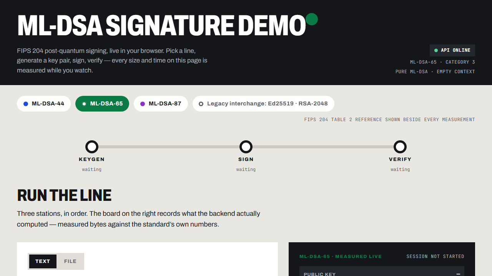

# ML-DSA Signature Demo

**Live post-quantum digital signatures in the browser** — ML-DSA (NIST FIPS 204)
keygen → sign → verify, with real cryptographic libraries, a Next.js frontend,
a FastAPI backend, and an evidence-first report.



## What it does

- **Sign with ML-DSA-44 / ML-DSA-65 / ML-DSA-87** (FIPS 204) — real library
  calls, no simulation — compared live against classical Ed25519 and RSA-2048
  with runtime-measured timings.
- **File interchange:** upload a file → sign → download `<name>.ml-dsa` →
  open that container anywhere → verify → extract the original bytes
  byte-for-byte. The server never stores anything.
- **Drills that show failure:** flip one character and the signature dies;
  a fresh key pair cannot verify an old signature.
- **Stateless by design:** no database, no accounts, no file uploads kept.
- **First viewport = live proof:** station status and the Keygen → Sign →
  Verify route are above the fold at 1280×720.

## Quick start (Docker)

```bash
git clone https://github.com/dodinhhoanganhcmc/demo-ML-DSA.git
cd demo-ML-DSA
docker compose up --build
```

Open **http://localhost:3000** — use `localhost`, not `127.0.0.1:3000`
(the API allows exactly `http://localhost:3000` and `http://127.0.0.1:3000`,
and the page calls the API on port 8000 directly from the browser).

## Local development

```bash
# backend — Python 3.13
cd backend
pip install -r requirements.txt
uvicorn app.main:app --port 8000

# frontend — Node 24
cd frontend
npm ci
npm run build && npm run start   # or: npm run dev
```

## Tests — 89 automated checks

| Suite | Count | Command |
|---|---:|---|
| Backend (pytest) — API contract + adversarial upload path | 42 | `cd backend && pytest tests -q` |
| Frontend (vitest) — container format, byte utils, components | 40 | `cd frontend && npx vitest run` |
| End-to-end (Playwright) — real browser ↔ real backend | 7 | `cd frontend && npx playwright test` (stack must be running) |

CI runs the same commands on every push (`.github/workflows/ci.yml`:
pytest · vitest + build · `docker compose build` · e2e).

## Evidence & documentation

| Document | Contents |
|---|---|
| [`REPORT.md`](REPORT.md) | Full report: standard → implementation → conformance → tests → CI → Docker → **rubric mapping** |
| [`docs/evidence/FIPS-204-EVIDENCE.md`](docs/evidence/FIPS-204-EVIDENCE.md) | Primary sources (hash-pinned FIPS 204 + errata), Tables 1–2, 39/39 library checks, edge suite |
| [`docs/SECURITY-REVIEW.md`](docs/SECURITY-REVIEW.md) | Security checklist with commands and results |
| [`docs/audit/`](docs/audit/) | Website audit reports (score trajectory 74 → 82) |
| [`AI_USAGE.md`](AI_USAGE.md) | AI usage disclosure + human decision log |
| [`PRODUCT.md`](PRODUCT.md) | Product principles and scope decisions |

## Repository layout

```
backend/            FastAPI app (app/main.py) + 42 pytest tests
frontend/           Next.js 16 app + 40 vitest tests + 7 Playwright e2e tests
docs/               Evidence, security review, audits, screenshots
scripts/            Evidence-phase helpers (smoke test, OG image)
.github/workflows/  CI pipeline (4 jobs)
docker-compose.yml  Two services: frontend :3000, backend :8000 — no database
```

## Team

Đỗ Đình Hoàng Anh · Ngô Bình Quang Anh · Mai Đức Minh · Trần Lê Minh
— CMC University, Information Security.
